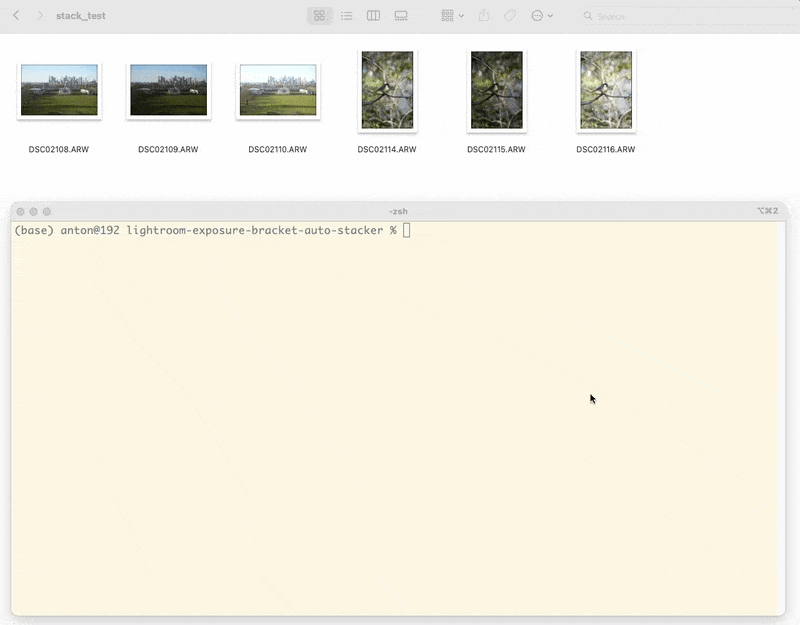
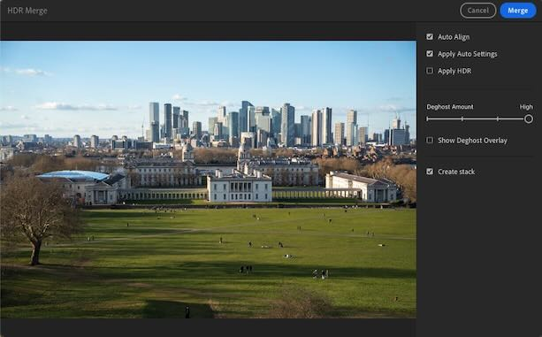
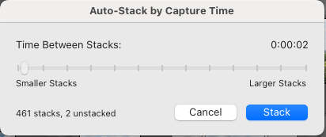

# Lightroom Auto Stacker Plugin

## Overview

The **Lightroom Auto Stacker Plugin** streamlines the process of creating HDR images by _automating the detection and stacking of exposure-bracketed photos_ in Adobe Lightroom. This tool is designed for photographers who manage large volumes of images or work with mixed sets of bracketed and single exposure photos. Using EXIF metadata, the plugin reliably groups photos taken in burst mode (3, 5, or any other number of exposures) – even when these images are intermingled with non-bracketed photos in the same folder.

## Purpose and Motivation

Adobe Lightroom (formerly Lightroom CC) and Lightroom Classic already offer HDR merge capabilities with some customizable settings (e.g., Deghost Amount). However, the workflow is mostly manual: you need to individually select image groups and invoke the HDR merge command for each stack.

This plugin addresses the challenges faced when:

- Merging a large number of images.
- Working with mixed photo collections where not all files are exposure bracketed.
- Managing different burst numbers in your shooting sequence.

While Lightroom Classic provides an "Auto-Stack by Capture Time" feature, it depends heavily on a precise time threshold between shots. This method can be fragile for photo collections captured under varying conditions, and the non-Classic version of Lightroom does not support auto-stacking at all.

Alternative HDR software exists (e.g., [LR/Enfuse](https://www.photographers-toolbox.com/products/lrenfuse.php?sec=quickguide)), but this plugin leverages Adobe Lightroom’s HDR merging capabilities while automating the grouping process.

## How It Works

The plugin reads each photo's metadata with [ExifTool](https://exiftool.org/), which is included, and uses the
information the camera records about its drive mode to find which frames belong to the same bracketed sequence, how
many frames it has, and which frame is the base exposure. It then imports the photos into Lightroom Classic with each
sequence as a stack, the base exposure on top, ready for Lightroom's own HDR merge.

Grouping works from what the camera wrote, not from timing, so it keeps sequences apart that were shot seconds apart,
keeps together long exposures that span several seconds, and never mixes a RAW file with its JPEG copy.

**Supported cameras:** Sony has been tested in Lightroom. Canon, Nikon, Panasonic and Pentax have been tested against
metadata from real bracketed sequences. OM System / Olympus and Fujifilm follow each camera maker's documentation but
have not been tested on real photos yet; the plugin says so when it finds them. See
[Camera support](docs/camera-support.md) for details.

## Help Wanted: Sample Photos

Support for a camera can only be confirmed with real photos from it. If you own one of the cameras below (or any other), a single complete bracketed sequence helps a lot:

- **Fujifilm** X-series: exposure and focus brackets
- **OM System / Olympus**: exposure brackets and a complete focus bracket
- **Canon** R-series (R5, R6, R7, R8, R10, R50): exposure and focus brackets
- **Nikon** Z (Z6 III, Z8, Z9, Zf): exposure brackets and a focus-shift sequence
- **Pentax**: any exposure bracket
- **Panasonic** Lumix: focus bracket or Post Focus
- **Any brand**: brackets of 5 or more frames, white-balance or other non-exposure brackets, fast bursts

What to send: every frame of the sequence, straight from the camera (RAW or the camera's own JPEGs, not exported from Lightroom or Photoshop, which removes the needed information). Only the metadata is kept in this repository, never the pictures, and serial numbers, names and locations are left out. Please open an issue with a link to the files and say whether they can be used here.

## Installation

Lightroom Classic is required; the cloud-based Lightroom does not support plugins.

1. **Get the plugin:** download `auto-stacker-<version>.zip` from the
   [latest release](https://github.com/anton-dergunov/lightroom-exposure-bracket-auto-stacker/releases/latest) and
   unzip it. It contains the `auto-stacker.lrplugin` folder, ExifTool included.
2. In Lightroom Classic, choose **File > Plug-in Manager**, click **Add**, select the `auto-stacker.lrplugin` folder
   and make sure the plugin is enabled.

Nothing else needs to be installed. After installing or updating the plugin, restart Lightroom Classic: it
sometimes does not see a plugin's new files until it restarts ("No script by the name ...").

**From the source code** instead: clone the repository, run `sh tools/fetch-exiftool.sh` once to download ExifTool
into the plugin, and add the `auto-stacker.lrdevplugin` folder in the Plug-in Manager.

## Usage

All commands are under **Library > Plug-in Extras**.

1. **Import and stack.** Choose one of:
   - **Import Only Bracketed Photos, as Stacks...**: imports just the bracketed sequences of a folder, each as a
     stack. Useful when you edit elsewhere and use Lightroom Classic only for HDR merging.
   - **Import Entire Folder, Brackets as Stacks...**: imports every photo of the folder, with the bracketed
     sequences stacked.

   Choose the folder (subfolders are included). The plugin shows what it found and asks before importing. Photos
   already in the catalog are skipped; a sequence with any photo already imported is left out, because Lightroom
   can only stack photos while importing them. Afterwards the Library shows the folders the photos went to. Photos
   imported this way do not appear in Lightroom's *Previous Import* collection.

2. **Merge all stacks into HDR images.**
   - Choose **Photo > Stacking > Collapse All Stacks**.
   - Select the stacks and choose **Photo > Photo Merge > HDR...** (Ctrl+H; Control+H on macOS). Lightroom merges
     each stack in turn, using the settings you chose last (such as Deghost Amount). Ctrl+Shift+H (Control+Shift+H on
     macOS) merges without showing the dialog.
   - Turn on **Create Stack** in the HDR dialog to keep each HDR image in the stack with its source photos.
   - Merging many stacks takes a while, but afterwards every HDR image is ready to compare with its source photos
     while culling.

3. **Find the HDR images.** They are saved next to the source photos and named after one of them, ending in
   `-HDR.dng`. To list only them, filter the Library by file type DNG. If you edit in the cloud-based Lightroom,
   export them or copy the files.

4. **(Optional) Remove the extra exposures.** Select the merged stacks (or show their folder with nothing selected)
   and choose **Reject Extra Exposures After HDR Merge...**. It flags the over- and under-exposed photos of each
   merged stack as rejected and keeps the base exposure, or flags all source photos if you choose so. Stacks without
   an HDR image are left alone. Then choose **Photo > Delete Rejected Photos**: *Remove* takes them out of the
   catalog, *Delete from Disk* also moves the files to the Trash.

## Implementation Q&A

Below are some frequently asked questions regarding the design and implementation of this plugin:

### Q: Can I auto-stack images that are already in the Lightroom library using this plugin?  

**A:** No. The auto-stacking process requires the images to be imported during the workflow. The Lightroom SDK does not currently expose an API for stacking images already present in the library. The tool [Any Source](https://johnrellis.com/lightroom/anysource.htm) implements workarounds to make it work, but their functionality is similar to Lightroom’s native "Auto-Stack by Capture Time" and does not leverage EXIF metadata for robust grouping.

### Q: Why does the plugin import the photos instead of stacking photos I have already imported?

**A:** The Lightroom SDK can create stacks only while importing photos, so grouping and importing happen in one
step. For the same reason the plugin reads the metadata from the files with ExifTool rather than from the catalog.

### Q: Can the plugin start the HDR merge itself?

**A:** No. The Lightroom SDK does not let plugins start Photo Merge, collapse stacks or remove photos from the
catalog, so those steps use Lightroom's own commands as described above.

### Q: Why is it required to Collapse All Stacks before merging them?  

**A:** This step is required so that HDR merge is correctly applied to each stack. Plugins cannot collapse stacks, so it must be done from the menu.

## License

This project is licensed under the [MIT License](LICENSE). The plugin includes [ExifTool](https://exiftool.org/) by Phil Harvey, which is free software distributed under the same terms as Perl itself.

## Disclaimer

This project is **not affiliated with or endorsed by Adobe Systems Incorporated**. Adobe Lightroom is a trademark of Adobe Systems Incorporated.

## Contributions

Contributions, bug reports, and feature requests are welcome. Please open an issue or submit a pull request on GitHub.

## Contact

For any questions or suggestions, please open an issue on the GitHub repository.
