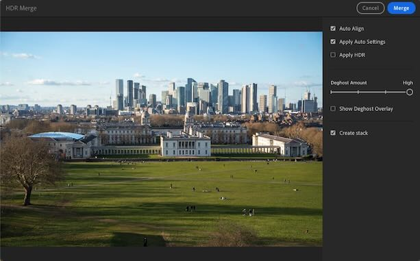

# Lightroom Auto Stacker Plugin


## Overview

The **Lightroom Auto Stacker Plugin** streamlines the process of creating HDR images by _automating the detection and stacking of exposure-bracketed photos_ in Adobe Lightroom. This tool is designed for photographers who manage large volumes of images or work with mixed sets of bracketed and single exposure photos. Using EXIF metadata, the plugin reliably groups photos taken in burst mode (3, 5, or any other number of exposures) – even when these images are intermingled with non-bracketed photos in the same folder.

## Purpose and Motivation

Adobe Lightroom (formerly Lightroom CC) and Lightroom Classic already offer HDR merge capabilities with some customizable settings (e.g., Deghost Amount). However, the workflow is mostly manual: you need to individually select image groups and invoke the HDR merge command for each stack.



This plugin addresses the challenges faced when:

- Merging a large number of images.
- Working with mixed photo collections where not all files are exposure bracketed.
- Managing different burst numbers in your shooting sequence.

While Lightroom Classic provides an "Auto-Stack by Capture Time" feature, it depends heavily on a precise time threshold between shots. This method can be fragile for photo collections captured under varying conditions, and the non-Classic version of Lightroom does not support auto-stacking at all.


Alternative HDR software exists (e.g., [LR/Enfuse](https://www.photographers-toolbox.com/products/lrenfuse.php?sec=quickguide)), but this plugin leverages Adobe Lightroom’s HDR merging capabilities while automating the grouping process.

## How It Works

The solution is divided into two components:

- **Python Script**:  
  Detects exposure-bracketed image groups using EXIF metadata. It then produces a descriptive file that outlines the detected groups. This method is more reliable than relying solely on capture timing.

- **Lightroom Plugin**:  
  Reads the group description file and imports the grouped images into Lightroom, automatically stacking them in preparation for HDR processing. Once the stacks are created, you can use Lightroom's built-in HDR merge functionality to batch process the stacks.

**Note:** The current implementation supports EXIF metadata from Sony cameras only. It has been tested on recent mirrorless and point-and-shoot models. If you use another camera manufacturer, please share sample bracketed images so the tool can be adapted accordingly.

## Installation

### Python Script

1. **Install Python** (if not already installed).
2. **Clone the Repository:**
   ```sh
   git clone https://github.com/anton-dergunov/lightroom-hdr-auto-stack.git
   cd lightroom-hdr-auto-stack
   ```
3. **Install Dependencies:**
   ```sh
   pip install -r requirements.txt
   ```

### Lightroom Plugin

1. **Launch Adobe Lightroom Classic**  
   (Note: The non-Classic version does not support plugins as of now.)
2. **Open Plug-in Manager:**
   - Navigate to **File > Plug-in Manager**.
3. **Add the Plugin:**
   - Click **Add** and select the `auto-stacker.lrplugin` folder.
   - Enable the plugin once added.

## Usage

1. **Detect Bracketed Images and Generate Groups File:**
   Run the Python script to analyze your photos and create a group description file.
   ```sh
   python group_sony_bracketed_photos.py --input /path/to/photos --output /path/to/groups.txt
   ```
   You may specify a different photo file extension with `--extension` (default is `ARW`).

2. **Import and Auto-Stack in Lightroom:**
   - In Lightroom Classic, go to **Library > Plugin Extras > Import and Auto Stack Photos**.
   - Provide the path to the generated groups file.
   - Wait for the images to be imported and automatically stacked.

3. **Batch Create HDR Images:**
   - Navigate to the folder containing the imported stacks.
   - Collapse all stacks via **Photo > Stacking > Collapse All Stacks**.
   - Select all stacks (**Edit > Select All**) and execute **Photo > Photo Merge > HDR...**.
   - Lightroom will initiate a batch job to merge each stack with previously used settings (e.g., Deghost Amount). Please note that this process can be time-consuming when handling a large number of images.
   - This batch processing ensures that all HDR images are created upfront, allowing for a streamlined photo culling process where HDR and original exposures are available for direct comparison.

4. **Access the Final HDR Images:**
   - If you are using Lightroom Classic, you can continue working with the HDR images directly within the library. To quickly find the HDR images, you can filter the Library View by the `.dng` extension.
   - If you primarily use the the non-Classic version of Lightroom, you can export the created HDR images. The generated HDR images are saved in the same folder as the original files, typically named using the first image’s filename followed by `-HDR.dng`, so you can copy them directly as well.

## Implementation Q&A

Below are some frequently asked questions regarding the design and implementation of this plugin:

### Q: Can I auto-stack images that are already in the Lightroom library using this plugin?  

**A:** No. The auto-stacking process requires the images to be imported during the workflow. The Lightroom SDK does not currently expose an API for stacking images already present in the library. The tool [Any Source](https://johnrellis.com/lightroom/anysource.htm) implements workarounds to make it work, but their functionality is similar to Lightroom’s native "Auto-Stack by Capture Time" and does not leverage EXIF metadata for robust grouping.

### Q: Why is there a separate Python script for group detection? Why not integrate it into the Lightroom plugin?  

**A:** Group detection relies on EXIF metadata. While the Lightroom SDK provides an API for accessing this metadata, it can only be used for photos that are already in the library. However, since stacking can only be performed at the time of import (see previous question), the plugin cannot use this API for grouping. For this reason, I chose to handle group detection separately in a dedicated Python script.

### Q: Why is it required to Collapse All Stacks before merging them?  

**A:** This step is required so that HDR merge is correctly applied to each stack. Unfortunately, Lightroom SDK does not provide a way to collapse stacks programmatically, so it must be done via the menu.

## License

This project is licensed under the [MIT License](LICENSE).

## Disclaimer

This project is **not affiliated with or endorsed by Adobe Systems Incorporated**. Adobe Lightroom is a trademark of Adobe Systems Incorporated.

## Contributions

Contributions, bug reports, and feature requests are welcome. Please open an issue or submit a pull request on GitHub.

## Contact

For any questions or suggestions, please open an issue on the GitHub repository.
